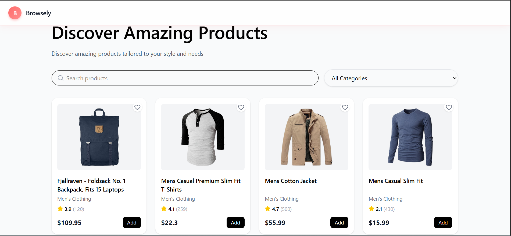
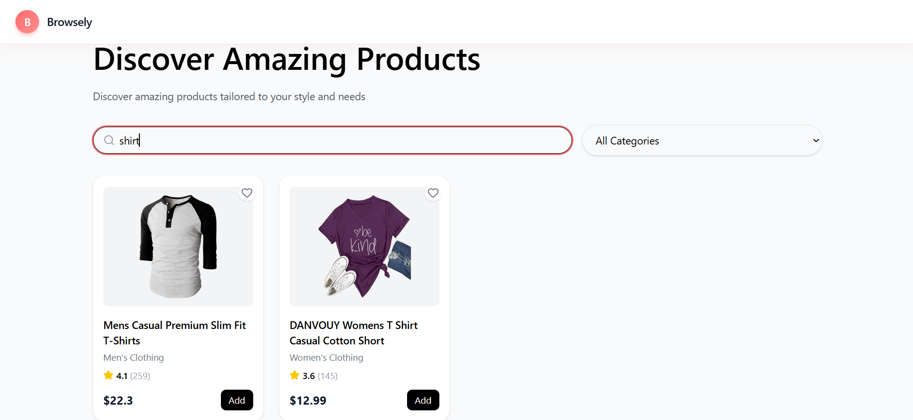
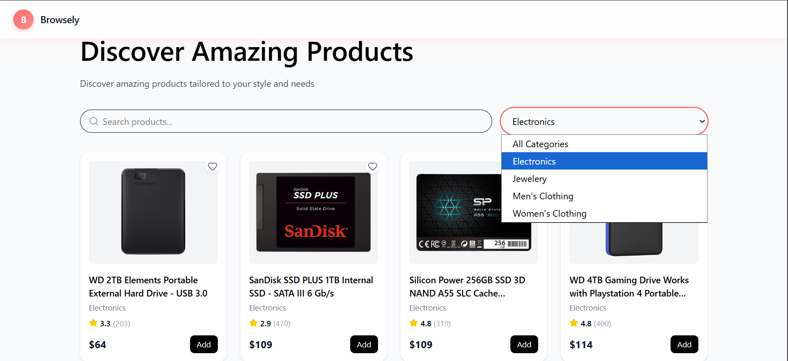
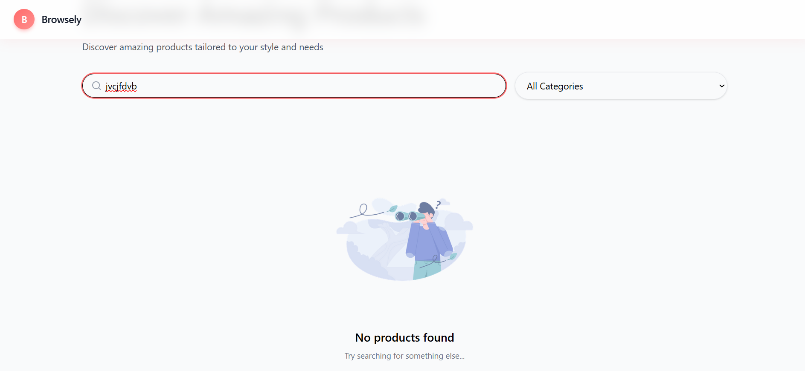
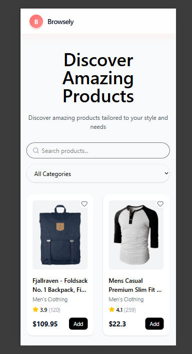
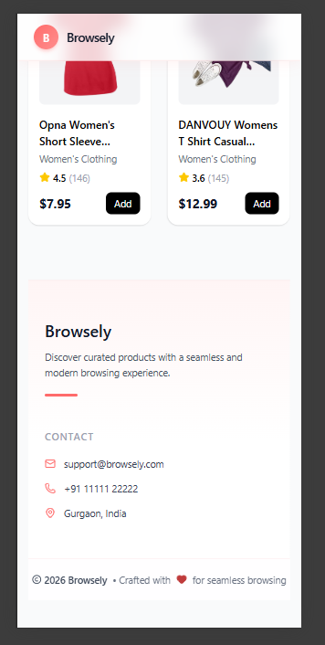

# Browsely - Interactive Data Explorer

Browsely is a responsive single-page web application that allows users to explore, search, and filter products using data fetched from an external API.

## Live Demo

https://browsely-app.vercel.app/

## Repository

https://github.com/medhavi-cmd/Browsely-App.git

## Features
Responsive product grid layout
Real-time search functionality
Category-based filtering
Loading state handling
Error handling for API failures
Empty state for no results
Fully responsive design
Screenshots

### Homepage

Displays the main product grid along with the navigation and overall layout.

### Search Functionality

Shows real-time filtering of products based on user input.

### Category Filtering

Demonstrates filtering based on selected category.

### Empty State

Displays a message when no products match the search.

### Mobile View

Shows the responsive layout on smaller screens.

Technologies Used
React (Vite)
Tailwind CSS
JavaScript (ES6+)
Axios
Framer Motion
API Used

## Fake Store API
https://fakestoreapi.com/products

## Key Architectural Decisions

Component-Based Structure
The application is divided into reusable components such as Navbar, Searchbar, ProductCard, Loader, Error, and Footer.

State Management
React hooks (useState, useEffect) are used to manage data and UI state.

Client-Side Filtering
Filtering is handled on the client side to improve performance and responsiveness.

User Experience Handling
Loading, error, and empty states are implemented to enhance usability.

Responsive Design
The layout is designed to adapt across different screen sizes using Tailwind CSS.

## Project Structure
src/  
 ├── components/  
 │    ├── Navbar.jsx   
 │    ├── Searchbar.jsx   
 │    ├── ProductCard.jsx  
 │    ├── Loader.jsx  
 │    ├── Error.jsx  
 │    └── Footer.jsx  
 ├── App.jsx  
 └── main.jsx  

## Setup Instructions
Setup Instructions
git clone https://github.com/your-username/browsely.git   
cd browsely
 
npm install
 
npm run dev

## Author
Medhavi Singh
